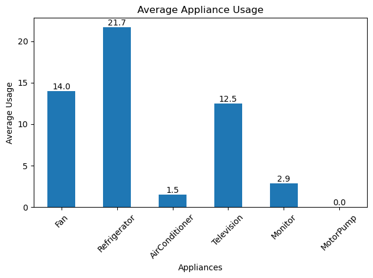
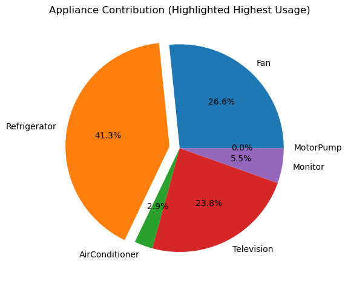
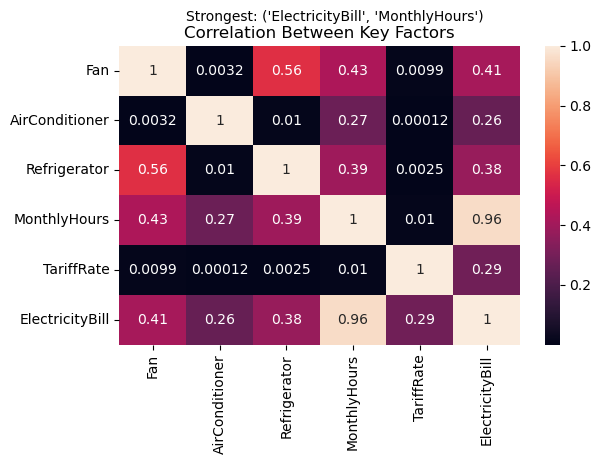

#  Electricity Consumption Analysis

##  Overview
This project analyzes household electricity consumption data using Python to uncover patterns in energy usage and identify key factors affecting electricity bills.

The analysis focuses on understanding how appliance usage, tariff rates, and total monthly usage contribute to overall electricity costs.

---

##  Key Insight
> MonthlyHours showed the strongest correlation with ElectricityBill (~0.96), indicating that overall usage duration is the primary driver of electricity cost, more than individual appliances or tariff rates.

---

##  Visualizations Included
- Average Appliance Usage (Bar Chart)
- Tariff Rate vs Electricity Bill (Scatter Plot)
- Electricity Bill Distribution (Histogram)
- Appliance Contribution (Pie Chart with Highlight)
- Average Electricity Bill by City (Bar Chart)
- Correlation Heatmap (Key Factors)

---

##  Tools & Libraries
- Python  
- Pandas  
- Matplotlib  
- Seaborn  

---

##  Screenshots

### 🔹 Appliance Usage

### 🔹 Analysis View

### 🔹 Heatmap Insight

---

